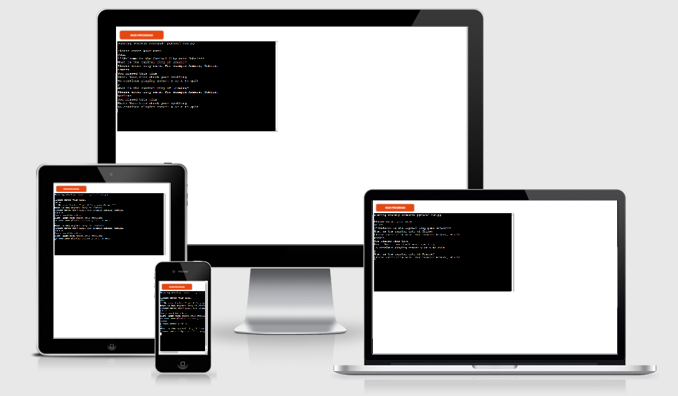
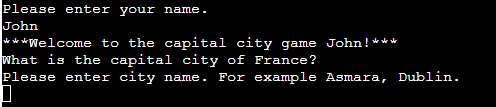
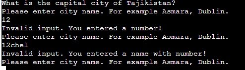
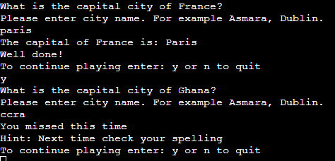
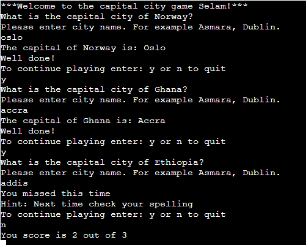
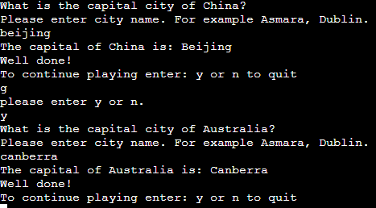
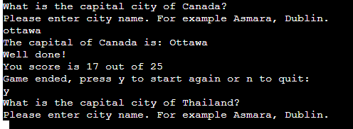

# Capital City Game

The capital city game is a simple Python terminal game that can be played by children and adults. It runs on Code Institute's mock terminal on Heroku. This game provides the opportunity to learn about the capitals of the different countries in the world while at the same time having fun. The game can be useful to school children when they are studying geography. Moreover, the capital city game could also inspire the players of the game to travel the world to visit the different capitals, and the countries in which they are located. In addition, the game also helps to expand the general knowledge of the player.

[Here is the live version of my project](https://capital-city-quiz-game.herokuapp.com/)

## How to play
The capital city game is an easy game to play. The user starts the game by pressing the run programe
button at the top of the game. The user is then requested to enter name, after that the game randomly chooses
one question out of 25 questions. The user then types in the response to the question, and receives a feed back.
The user can play the game as long as the user wants.

## Existing Features

### Welcome message
* When the player starts the game, the player is requested to input name.
* The player is then greeted with a welcome message that includes the players name.

### Input valiation
* when the player inputs a response to a question, the response is checked:
* Whether the input is a number or the input contains a number.
* Depending on the case the player gets appropriate feedback.
* The player also gets suggestions on the right format of input.

### Feedback to the user
* When the user anwers the question, the user gets two types of feedback:
* If the user gives the correct answer, the user receives well done message.
* If the user misses the right answer, the user gets a hint to check spelling.

### During the game
* The user can decide to continue playing or leave the game by choosing  'y' or 'n' respectively.
* If the user decides to leave before answering all the questions, the user can get a score report.

### Continuation response
* The user is asked to choose either 'y' or 'n' to continue palying.
* However, if the user inputs other letters, the user is requested again to input the right letter.

### End of game
* If the user anwers all the questions, the user get a score report.
* The user also gets the message 'game ended'.
* The user is then provided the option to continue playing or stop the game.

## Future Features
* Increase the number of questions to include all the capitals of the world

## Data Model

Two text files are used to store the country and capital city information. These files are then read into the program and stored in their respective list. 
 A capital city shares the same index with its respective country. A temporary list is used to store the index of the previously asked questions in order  to have
 random unrepeated questions, and this list gets cleared at the end of the game or when the user quits the game.

 ## Testing
* I have passed the code through PEP8 Python code validator and I found no problems.
* I have tested that the project handles invalid inputs such as numbers or strings with numbers.
* I have also tested on gitpod and Code Institute's Heroku Terminal.

## Bugs

### Solved Bugs

* During the development of the project I encountered an infinite while loop but I resolved the problem using the   right if and else statments that contain call back functions to exit the loop.

### Remaining Bugs
* There are no remaining bugs.

